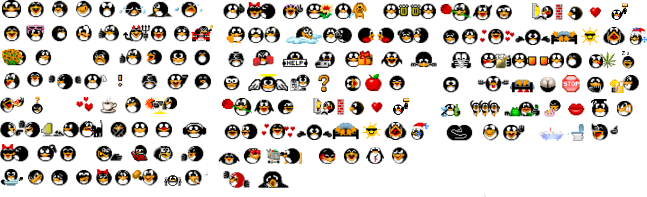

# [NodeBB](https://nodebb.org/) Plugin: **Emoji Cabane Libre** *\<nodebb-plugin-emoji-cabane-libre>*

A static cubicopp images emoji-set for NodeBB.

## Installation

Install and activate `nodebb-plugin-emoji` and `nodebb-plugin-emoji-cabane-libre` via the admin control panel of your NodeBB instance.

### Manual installation

The manual installation via [NPM](https://www.npmjs.com/) may result in version-conflicts with NodeBB.

    npm install nodebb-plugin-emoji nodebb-plugin-emoji-cabane-libre
